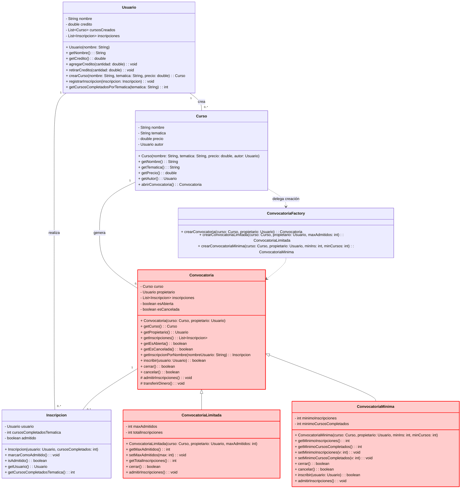

# P5- Calso

# Descripción del sistema de convocatorias (formandera.com)

El proyecto simula el comportamiento de un sistema de gestión de convocatorias de cursos de la plataforma educativa formandera.com, que se representa esquemáticamente en el diagrama siguiente.

En este sistema, un usuario registrado (caracterizado por su nombre y el crédito disponible) puede crear un curso y posteriormente abrir una convocatoria para ofrecer una nueva edición de dicho curso al resto de usuarios.
El único usuario que puede crear una convocatoria es el autor de curso y se convertirá en el propietario de la convocatoria.

En el momento en que el propietario abre una convocatoria, esta pasa a estar en estado “abierta” (ver Diagrama de estados), estado en el que los demás usuarios pueden inscribirse para participar en la edición del curso.

Una inscripción se caracteriza por el usuario que la realiza y por el número de cursos completados por el usuario en la misma temática que el curso ofertado.



Para poder inscribirse en una convocatoria ordinaria, deben cumplirse las siguientes condiciones:

  1. La convocatoria debe estar abierta.
  2. El usuario que se inscribe debe ser distinto del propietario del curso.
  3. El usuario debe disponer de crédito suficiente para pagar el precio del curso.
  4. El usuario no debe estar ya inscrito previamente en la misma convocatoria.

Cuando se cumplen todas las condiciones, se registra la inscripción y se descuenta el precio del curso del crédito del usuario. En cualquier momento, el propietario puede cerrar la convocatoria, con lo que esta pasa a estar en estado “cerrada”. Cerrar una convocatoria ordinaria implica admitir las inscripciones registradas y transferir el crédito correspondiente (precio del curso × número de alumnos admitidos) al propietario.
Si no existen inscripciones, la convocatoria no podrá cerrarse. Asimismo, el propietario puede cancelar la convocatoria, lo que hace que pase a estado “cancelada”. Cancelar una convocatoria significa devolver el crédito previamente descontado a todos los usuarios inscritos y finalizar el proceso sin admisiones.

 ```mermaid
stateDiagram-v2
    Cancelada --> [*]
    Cerrada --> [*]
    Cancelada --> Cancelada : inscribir()/cerrar()/cancelar()<br>retorna false
    

    [*] --> Abierta : new Convocatoria(curso)
    
    Abierta --> Abierta : inscribir(usuario)<br>[condición NO se cumple]<br>retorna false
    Abierta --> Abierta : cerrar()<br>[sin inscripciones admitidas]<br>retorna false

    Abierta --> Cerrada : cerrar()<br>[existen inscripciones admitidas]<br>retorna true<br>/transferirDinero()
    Abierta --> Cancelada : cancelar()<br>retorna true<br>/restituir créditos

    Cerrada --> Cerrada : inscribir()/cerrar()/cancelar()<br>retorna false
    

    
    

    %% Notas explicativas
    note right of Abierta
      Estado inicial tras crear la convocatoria.<br>
      esAbierta = true, esCancelada = false.<br>
      Permite inscripciones válidas.<br>
      cerrar() sólo cambia de estado si hay inscripciones admitidas.
    end note

    note right of Cerrada
      Estado final exitoso.<br>
      esAbierta = false, esCancelada = false.<br>
      Se transfieren créditos al propietario.<br>
      No se aceptan nuevas inscripciones.
    end note

    note right of Cancelada
      Estado final no exitoso.<br>
      esAbierta = false, esCancelada = true.<br>
      Se devuelven los créditos a los usuarios inscritos.<br>
      No se aceptan nuevas inscripciones.
    end note


```
## Tipos de convocatorias

El sistema contempla tres tipos de convocatorias, todas ellas heredadas de la clase base Convocatoria:

### 1. Convocatoria ordinaria

Es el tipo de convocatoria por defecto.
Todas las inscripciones registradas se consideran admitidas cuando se cierra, siempre que haya al menos una.
El cierre puede ejecutarse en cualquier momento y transfiere el crédito total al propietario del curso.

[Ver Especificación de métodos de la clase Convocatoria](./docs/especificacionConvocatoria.md)

### 2. Convocatoria limitada

Es una especialización de Convocatoria que restringe el número máximo de inscripciones admitidas.
Este número máximo se fija en el constructor.

En el momento del cierre, se seleccionan como admitidos los usuarios con mayor número de cursos completados en la temática del curso, en orden descendente, hasta agotar el número de plazas disponibles.
Si no se alcanza al menos una inscripción admitida, la convocatoria no puede cerrarse.

[Ver Especificación de métodos de la clase ConvocatoriaLimitada](./doc/especificacion_Métodos_ConvocatoriaLimitada.md)

### 3. Convocatoria mínima

Es un tipo de convocatoria que establece dos condiciones mínimas en el momento de su creación:

  - Un número mínimo de inscripciones para poder cerrar la convocatoria.
  - Un mínimo de cursos completados en la temática del curso que deben tener los usuarios para poder inscribirse.

La convocatoria mínima solo puede cerrarse si se cumple el número mínimo de inscripciones.
Si no se alcanza ese mínimo, permanecerá abierta hasta que el propietario decida cancelarla, en cuyo caso los créditos de los usuarios inscritos son devueltos.

El comportamiento de admisión en el cierre es idéntico al de la convocatoria ordinaria: todas las inscripciones válidas se admiten.

[Ver Especificación de métodos de la la Clase ConvocatoriaMinima](./dov/especificacion_Métodos_ConvocatoriaLimitada.md)

---
## Ejercicios
1. Descargar el proyecto de la práctica que se encuentra en la carpeta formandera-convocatorias.
2. Elaborar un documento md que contenga una tabla con el diseño de los casos de prueba de métodos para la clase Convocatoria. Los casos de prueba diseñados deben aseguren la cobertura del código de cada método, atendiendo a su especificación. Dicha tabla debe contener, como mínimo, los siguientes datos:
    a. Método sobre el que se realiza la prueba.
    b. Nombre significativo del test propuesto.
    c. Breve descripción del objetivo del test diseñado
    d. Configuración del estado y parámetros de entrada asociados al test
    e. Estado/valor esperado que se comprobará en el caso de prueba (diseño de asserts)
3. Implementar los casos de prueba de métodos para la clase Convocatoria en la clase ConvocatoriaTest, dentro de la carpeta y paquete adecuado, diseñados en el paso anterior.
4. Analizar el diagrama de estados de la clase Convocatoria y crea un nuevo documento md con: la expresión regular que determina las secuencias aleatorias asociadas a la clase y una tabla que contenga el diseño de las pruebas de clase aleatorias de manera que aseguren que se ejercitan todos los posibles estados de los objetos. La tabla debe contener la siguiente información:
    a. Nombre significativo del test propuesto.
    b. Secuencia aleatoria que se pretende probar
    c. Configuración y parámetros de entrada al test
    d. Estado/valor esperado después de la ejecución
5. Añadir, idenitificando la sección con un comentario, la implementación de los casos de pruebas de clase aleatorias diseñados en el apartado anterior en la clase ConvocatoriaTest
6. Elaborar un nuevo documento md donde se identifiquen los errores encontrados utilizando el conjunto de pruebas de los ejercicios 3 y 5. En este archivo se indicará el método o secuencia donde se produce el error, el test que lo identifica y las modificaciones realizadas sobre el código que corrijan el error descrito. Además, se añadirá la captura de pantala de la vista de jUnit donde se muestre el resultado final de la ejecución de todos os test. 
7. Implementar las clases de prueba ConvocatoriaMínimaTest y ConvocatoriaLimitadaTest como descendientes de ConvocatoriaTest. Antes de realizar la implamentación de casos de prueba de cada una de ellas, ejecuta todos los test de ConvocatoriaTest en las clases hijas (las heredarán directamente) para ver qué nuevos casos debemos incorporar o modificar.
8. Implementar los casos de prueba de cada una de las subclases (ConvocatoriaMínimaTest y ConvocatoriaLimitadaTest) siguiendo las recomendaciones vistas en clase.
9. Elabora un nuevo documento md donde se identifiquen los test que se pueden reutiizar en cada una de las clases hijas, los que requieren modificación y los nuevos test que se han incorporado. Además, se estudiarán los errores encontrados en las calases hijas, indicando el test que determina el error y los cambios derivados. Además, se incoporará el estudio de la cobertura, de forma separada, de las clases hijas por loscasos de prueba diseñados en las clases ConvocatoriaLimitadaTest.java y ConvocatoriaMinimaTest.java.
---
## Evaluación
- Se ofrece un archivo md con la tabla indicada en el ejercicio 2 y se enlaza en el README.md del repositorio - 0,25 puntos
- Diseño y completitud de los casos de prueba de métodos insertados en la tabla indicada en el ejerccio 2 - 1,5 punto
- Se preenta un nuevo archivo md con la expresión regular de las secuencias y el diseño de los casos de prueba de clase y se enlaza desde el README.md - 0,5 puntos
- Identificación, diseño y completitud de las pruebas de clase por el método de secuencias aleatorias que se solicita en el ejercicio 3 - 1.5 puntos
- Se preenta un nuevo archivo md con la identificación de los errores y modificaciones en el código que se indica en el ejercicio 6 y se enlaza desde el README.md - 0,25 puntos
- Implementación, ejecución e identificación de errores de los casos de prueba de métodos y de clase diseñados 1,5 puntos.
- Se preenta un nuevo archivo md con la información solicitada en el ejercicio 9 y se enlaza desde el README.md - 0,25 puntos.
- Diseño, implementación, completitud, errores detectados y análisis de cobertura de las pruebas de herencia recogidas en el documento md indicado en el ejercicio 9 - 3,75 puntos.
- Trabajo en ramas individuales de cada miembro del grupo - 0,5 puntos
## Entregables
La entrega se realizará en la tarea del Aula Virtual asignada a la práctica con fecha de entrega 12/12/2025 23:55 horas y se debe entregar:
- Todos los alumnos (todos los miembros de cada grupo) entregarán el enlace al repositorio de la práctica del grupo
